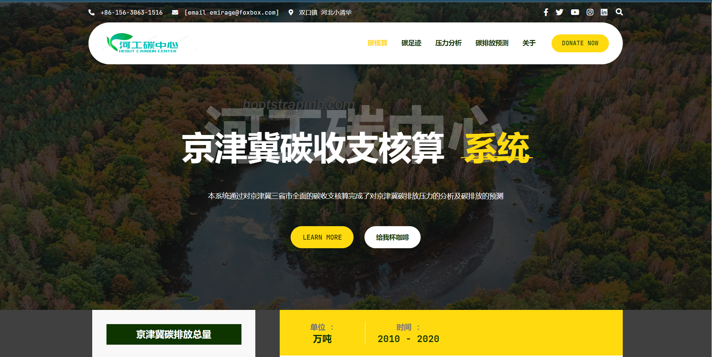
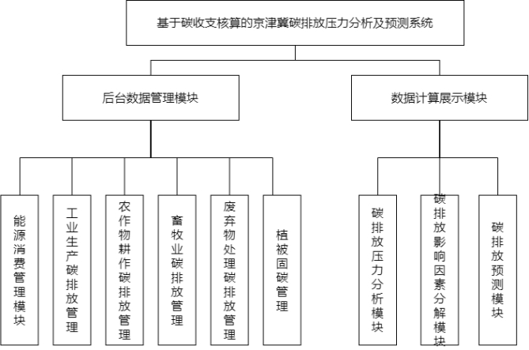
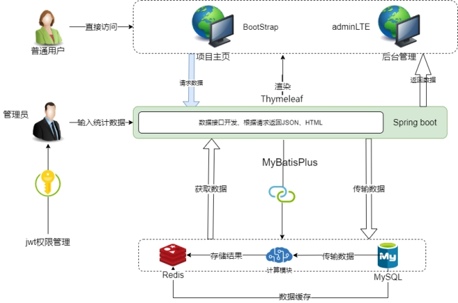

# 由于服务器限制仅允许国内IP访问，若无法访问请下梯子


### 课题简介

基于碳收支核算的京津冀碳排放压力分析及预测系统
近年来，气候变化已经成为人类社会普遍关注的全球性问题。
碳收支核算是**全球气候变化研究的内容之一。
**目前的研究主要侧重于**对自然生态过程的碳循环**、
碳收支及碳平衡的研究。城市是人类各种产业活动集中分布的区域，
科学地评估城市碳收支状况不仅有助于**建立科学的城市碳收支清单**，
全面**认识全球气候变化规律**，**而且对于低碳城市发展策略制定
也具有重要的实践意义。**本研究采用**京津冀能源消费、土地利用、
人口、工业生产等相关数据**，对京津冀能源活动、工业生产、农业生产过程、
废弃物处置的碳排放及碳吸收量**建立核算算法**。对京津冀区域碳排放进行
**较为全面的核算**，并**进一步对碳排放强度、人均碳排放量
及生态足迹进行分析**。本毕业设计不涉及有违社会、健康、安全、法律、
文化以及环境和工程伦理等方面的内容。

### 关键词
碳收支核算，碳排放压力分析及预测，京津冀


## 项目简介

对京津冀的多项碳排放来源进行了收支核算，并根据核算数据对碳排放压力、碳足迹、生态赤字、碳排放影响因素等信息进行了分解与预测。

项目内容：  

## 项目截图


更多截图见项目中     /文档/论文定稿

也可以访问项目网址

http://carbon.bishe.emirage.top/index


如果访问网址，您发现，加载的非常的慢，这是服务器的原因。如果无法访问，可能是服务器到期了，服务器到期日期大概为2024年1月。

由于资金限制，本人项目与博客搬到了另一家性价比更高的云服务器商。但并不打算继续维护本项目。见谅。

## 开发环境

- MySQL 8.0
- Redis 4.0
- Sa-token
- ECharts
- JDK 8
- Maven 3.6
- IntelliJ IDEA 2021.3（可选）
- templates
- MyBatis plus

### 项目结构

#### 目录结构

(只标注有用一点的)

src

 - main
   - java
     - annotation
     - config
       - MyMvcConfig   配置拦截器与拦截路径
       - RedisConfig   redis配置类
     - controller
       - ExcelExportController     Excel导入导出控制
       - GloablExceptionHandler    全局错误处理
       - LoginController    实现登陆登出
     - dao
     - entity
     - Filter
       - JwtAuthenticationTokenFilter    jwt 过滤器
     - interceptor
       - LoginInterceptor    登陆拦截器
     - Listener 
     - service
     - utils
       - Anticipate      碳排放预测计算模块
       - getData         统一获取数据类
       - Lmdi           LMDI计算模块
       - Tapio          脱钩指数计算模块
       - TokenUtils      jwt工具类 
     - CarbonApplication
   - resources
     - static
     - templates
       - crud     后台界面
       - error
       - show     前台数据展示界面
       - index.html
       - login.html
     - banner.txt     美美哒控制台打印数据
     - application.properties
 - sql
   - carbon.sql       

文档

​	- 论文定稿


#### 项目结构整体





项目分为两个模块，一块是对数据的增删改查，一块是数据的可视化

可在项目启动后进行访问

后台管理界面

http://127.0.0.1:8080/admin

前台可视化界面

http://127.0.0.1:8080/index

###  使用方法

1.数据库导入carbon.sql文件（需要提前创建数据库），里面是从国家统计年鉴中搜集的数据

2.启动redis

3.修改项目中配置文件

```
spring.datasource.driver-class-name=com.mysql.cj.jdbc.Driver
spring.datasource.url=jdbc:mysql://localhost:3306/carbon?characterEncoding=utf-8&useSSL=false&serverTimezone=Hongkong
spring.datasource.username=root
spring.datasource.password=123456
spring.datasource.type=com.zaxxer.hikari.HikariDataSource
spring.datasource.hikari.maximum-pool-size=15
spring.datasource.hikari.minimum-idle=5
spring.datasource.hikari.idle-timeout=30000

spring.redis.host= localhost
spring.redis.port=6379


sa-token.token-name=satoken

sa-token.timeout= 2592000

sa-token.activity-timeout=-1

sa-token.is-concurrent= true

sa-token.is-share=true

sa-token.token-style=uuid

sa-token.is-log= false

```

主要修改

spring.datasource.url  中的 IP:port  以及数据库名。（大陆用户不需要修改时区）

将用户名和密码设置为您MySQL中的用户名和密码

配置redis的IP和端口号


4.启动项目


访问地址

后台管理界面

http://127.0.0.1:8080/admin

前台可视化界面

http://127.0.0.1:8080/index


# 结语

显而易见这是一个本科毕业设计的项目，本人技术也是稀碎，主要工作量并不是编写代码，而是看论文、写算法以及收集那该死的数据。

截止开始编写项目时，本课题没有多少可以抄袭的东西，这可能是由于这个课题是新出的，为了顺应政策。

如果本项目有幸被您看到，并为您提供一些帮助，这是本人的荣幸。

祝

​	毕业顺利


